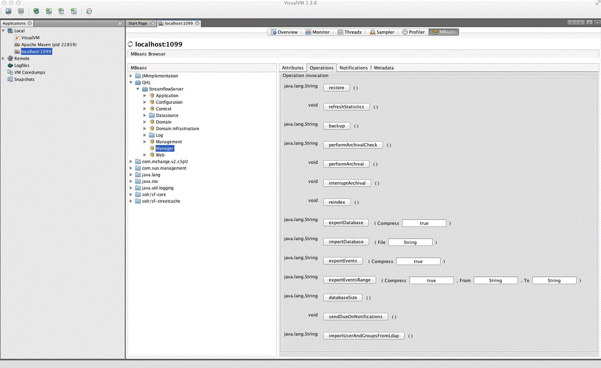
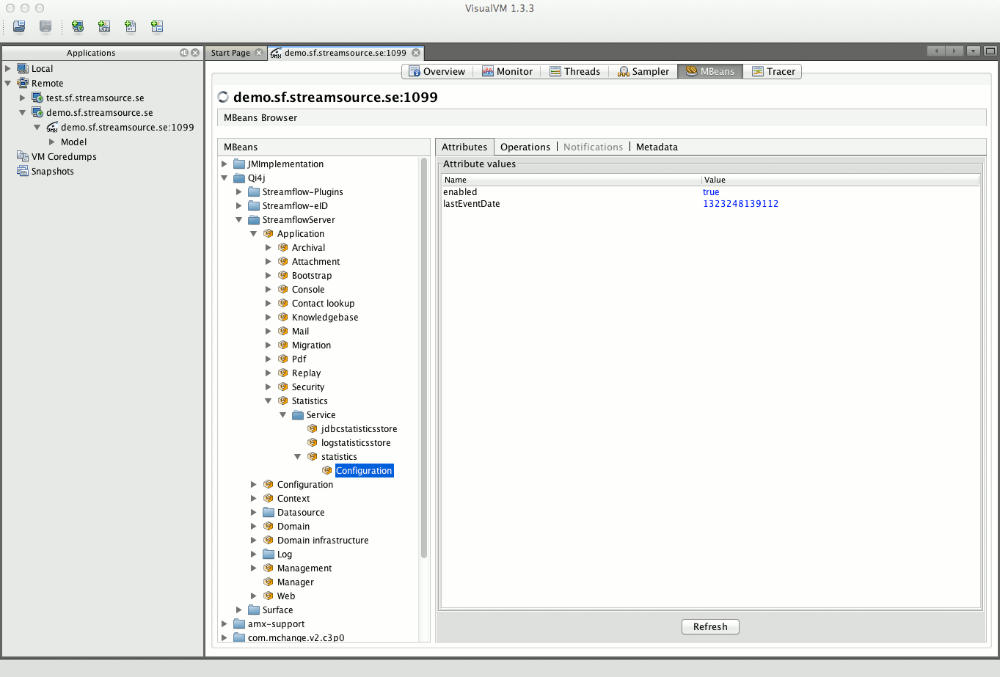
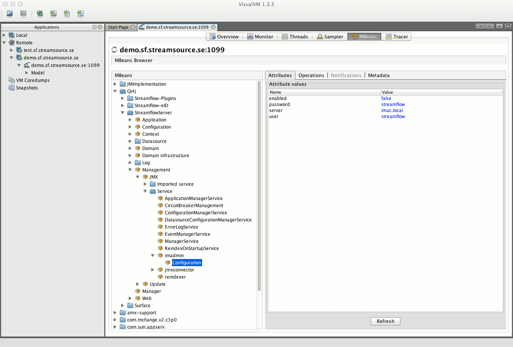

VisualVM Manager
################

Streamflow Service Configuration
********************************

VisualVM - Getting started
^^^^^^^^^^^^^^^^^^^^^^^^^^
    VisualVM is a managing and profiling tool included in the Java JDK installation and can be found under the installation folder in the bin directory. The simplest is to run the application on the server itself , but with the right settings of firewall etc , you can use from a client computer.

    Streamflow is utilizing this tool for managing services and configurations.

    The executable file is **JAVA_HOME/bin/jvisualvm(.exe)** or you can download it from https://visualvm.github.io/download.html

    If you run on the server and the OS is Windows then VisualVM needs to run as Administrator. VisualVM should have rights to view Java processes that belong to the system profile . Initially, you also need to install VisualVm - MBeans plugin available under Tools / Plugin.

    Under *"Local"* you need to add a JMX connection that goes against **localhost:1099**with the administrator user.

    .. image:: images/visual_vm_1_3_6.gif
        :align: center
        :width: 100%

    Service Configuration is made on **MBeans** tab under **Qi4j/StreamflowServer/**

    On the first start we need to install the *MBean* plugin to be able to manage *Streamflow*.
    Choose Tools - Plugin on the menu bar and on the tab **Available Plugins -> VisualVM-MBeans -> Install**. Follow the install wizard.

    .. image:: images/visualvm_plugin.gif
        :align: center
        :width: 100%

Connect Streamflow locally on your server
^^^^^^^^^^^^^^^^^^^^^^^^^^^^^^^^^^^^^^^^^
    Right click on Local node in the tree and add a new JMX connection.
    Provide **localhost:1099** as address and the streamflow administrator user and password.

    .. image:: images/visualvm_remotehost.gif
        :align: center
        :width: 100%

Connect Streamflow remotely from your PC
^^^^^^^^^^^^^^^^^^^^^^^^^^^^^^^^^^^^^^^^
    Right click on Remote node and add a new Remote host.

    .. image:: images/visualvm_remotejmx.gif
        :align: center
        :width: 100%

    Right click on the new remote host and add a new JMX connection.

Manage Streamflow
*****************
    Open the JMX connection by double-clicking on the representing tree node.
    Change to the the MBeans tab and select/open the Qi4j tree node.
    All Qi4j applications running in this java process ( JVM ) will show up under the Qi4j node.

    .. image:: images/visualvm_mbeans.gif
        :align: center
        :width: 100%

StreamflowServer
****************

Main functions
==============
    In the tree find the node Qi4j/StreamflowServer/Manager and choose the tab Operations.

Operations
^^^^^^^^^^

backup
""""""
    If no initial event backup file exists a new event backup file is created otherwise a event diff file spanning from the last created event backup file or event backup diff file until the backup timestamp is created.

    This call makes also a backup copy of the Jdbm entity store in form of a g-zipped JSON file if there is no such file for the date when the method was called.

    A good practice is to do a backup of the data store at least after each successful Streamflow version upgrade since restore might not work properly over database version boundaries if there where structural changes involved between versions.

    If disk space becomes an issue it is advisable to empty the backup folder regularly and
    create a new fresh backup from scratch.

    The mentioned files can be found in the StreamflowServer folder under data/backup.

restore
"""""""
    Restores the Jdbm entity store from the latest backup file, restores the event store from event backup files and replays any application events from the event store that occurred between entity store backup file timestamp and now.

performArchivalCheck
""""""""""""""""""""
    This method checks for cases that can be archived according to the archival rules set up in the Streamflow administration Gui for case types.

performArchival
"""""""""""""""
    Performs a archival on cases that are due for archival according to the archival rules setup for case types. For now there is max age and archival type available as archival rules.

    That means to be an archival candidate a case must be in status closed and must have reached maximum age for it's case type.

    There are two archival types available for now - delete and export.
    Delete removes the case from the system, export creates a PDF file of the case and saves it to the archive folder in StreamflowServer/data folder as <case-id>.pdf before it removes the case from the system.

interruptArchival
"""""""""""""""""
    Interrupt a commencing archival, both manual or scheduled archival can be interrupted with this command.

refreshStatistics
"""""""""""""""""
    Empties the statistics database entirely and recreates statistics for cases in status closed from the first start of the Streamflow application.

reindex
"""""""
    Removes the RDF and Solr indices and regenerates them.
    The rdf index is for fast access to the Jdbm entity store and the solr index is for fast free text searches on case data.( i.e. case id, description, note, contacts, searchable form fields, etc.)

    RDF - Resource Description Framework, an official W3C Recommendation for Semantic Web data models
    Solr - An Apache search engine based on Lucene

exportDatabase
""""""""""""""
    Exports the Jdbm entity store to a JSON file.

importDatabase
""""""""""""""
    Imports a database into the Jdbm entity store from a JSON file.

exportEvents
""""""""""""
    Exports the events from the event store to a JSON file.

exportEventsRange
"""""""""""""""""
    Exports the events of a range of time between given from and to date.

databaseSize
""""""""""""
    Returns the amount of objects located in the Jdbm store.

.. important::
    In general services have to be restarted in order to be able to pick up configuration changes!

Archival Configuration
----------------------

The archival service handles when and how cases are archived and removed or only removed from the system. The main configuration of this behavior is administrated inside the Streamflow administration GUI where you can set max age for cases of a certain case type or label before they are retired.

Archive Call Service
--------------------

Archive configuration , see **Qi4j/StreamflowServer/Application/Archival/Service/archival/Configuration**

This service is used in archival/removal of cases, ie archiving of files to pdf and removal of them, alternative only removal.

In Streamflows administration interface an administrator can specified for each case type and for each label the following:

    * Specify whether a case with a certain case type or label will be archived after a given number of days
    * Set what action to be taken, a) the saving of the case to file (pdf) and then removal of the case from Streamflow , or b) Only the removal of the case.

Background: Some cases are only interesting from a statistical standpoint, but can regularly removed from the Streamflow database Jdbm. One example can be if incoming calls to the contact center are labelled with a label "Connected call", and the label is used to remove cases in the Archival Service. One can set up cases with label "Connected call" shall be removed after an example 3 days.

It is advised that archiving/removal runs at night, after a daily complete backup. The service is such that the behaviour depends on a number of parameters, like how many cases it will handle for each activation of the operation, see Attributes below. If you haven´t done case removal before, then it will take a number of times before a balance is reached, where only the difference of cases between a day and the next are removed. Therefore, one can set up the constraints on the number of cases handled per operation.

Possibly it may in some cases be necessary with a re-indexing to optimise the index after extensive archiving / removal.

Setting Parameters in the tab Attributes
----------------------------------------

enabled - ``boolean``
"""""""""""""""""""""
    boolean
    If the service is on or off.

modulo - ``Integer``
""""""""""""""""""""
    Number of cases to be filed / deleted at a time before the service is paused.

sleepInMillis - ``Long``
""""""""""""""""""""""""
    How long in milliseconds the service should pause after each activation.

startSchedule - ``String``
""""""""""""""""""""""""""
    String
    Scheduling of service startup inspired by cron , eg 0 0 9 ** ( every day at 9 am )
    http://www.quartz-scheduler.org/documentation/quartz-2.1.x/tutorials/tutorial-lesson-06

startScheduledArchival - ``boolean``
""""""""""""""""""""""""""""""""""""
    Archive automatically or only manually.

stopSchedule - ``String``
"""""""""""""""""""""""""
    Scheduling of service stop. For format, see startSchedule.

Attributes
^^^^^^^^^^
enabled - ``boolean``
"""""""""""""""""""""
    Tells whether the archival service is enabled or not.

archiveDaily - ``boolean``
""""""""""""""""""""""""""
    Tells whether the archival service performs an automatic case archival once a day or not.

Operations
^^^^^^^^^^
restart
"""""""
    Restarts the service.

Remove Attachments Configuration
--------------------------------

The remove attachments service takes care of synchronising the removal of attached files from the attachment store corresponding to removed attachment entities. This is accomplished with help of application events related to attachment entity removal. If this service receives an event of a certain kind ( removedAttachment ) it will remove the appropriate attached files from the attachment store.

If the service is disabled over a period of time it will replay all events, since the point in time when it was disabled until the last event of that kind has been processed, once enabled again.

Attributes
^^^^^^^^^^
enabled - ``boolean``
"""""""""""""""""""""
    Tells whether the remove attachments service is enabled or not.

lastEventDate - ``long``
""""""""""""""""""""""""
    Holds the point in time ( linux epoch in milliseconds ) when the last event was processed.

Operations
^^^^^^^^^^
restart
"""""""
    Restarts the service.

Knowledge Base Configuration
----------------------------

The knowledge base service integrates an external knowledge base in form of a wiki website. So far only implemented for case types and labels. ( Not part of a Streamflow installation! )

Attributes
^^^^^^^^^^
caseTypeTemplate - ``String``
"""""""""""""""""""""""""""""
    An Url pointing out the wiki template for case types in the external wiki.

enabled - ``boolean``
"""""""""""""""""""""
    Telling whether this service is enabled or not.

labelTemplate - ``String``
""""""""""""""""""""""""""
    An Url pointing out the wiki template for labels in the external wiki.

Operations
^^^^^^^^^^
restart
"""""""
    Restarts the service.

Create Case From Email Configuration
------------------------------------

This service walks through all receivedEmail application events and creates cases in the system through email access points. Only works in conjunction with the receive email service.

Attributes
^^^^^^^^^^
enabled - ``boolean``
"""""""""""""""""""""
    Tells whether the create case from email service is enabled or not.
    If disabled, the client application will not show the email access point tab in the administration window.

lastEventDate - ``long``
""""""""""""""""""""""""
    Holds the point in time ( linux epoch in milliseconds ) when the last event was processed.

Operations
^^^^^^^^^^
restart
"""""""
    Restarts the service.

Receive Email Configuration
---------------------------

This service receives emails from a certain mailbox and persists the data as an application event that can be consumed by other services like CreateCaseFromEmailService or ConversationReplyService.
We recommend to use IMAP as your protocol of choice.

Attributes
^^^^^^^^^^
*archiveFolder - ``String``
"""""""""""""""""""""""""""
    The name of the archive folder where processed mails from the inbox are copied to.

debug - ``boolean``
"""""""""""""""""""
    Tells whether debug information from the java mail api should be printed to the log.

deleteMailOnInboxClose - ``boolean``
""""""""""""""""""""""""""""""""""""
    Tells whether mails flagged as deleted are removed on close of the inbox. This property must be set to true in a IMAP setup!

enabled - ``boolean``
"""""""""""""""""""""
    Tells whether this service is enabled or not.

host - ``String``
"""""""""""""""""
    The mail host name.

password - ``String``
"""""""""""""""""""""
    The password of the mailbox.

port - ``String``
"""""""""""""""""
    The port of the mail host used for receiving mail.

protocol - ``String``
"""""""""""""""""""""
    The protocol used by the mail host. Preferably imap

sleepPeriod - ``Integer``
"""""""""""""""""""""""""
    The sleep period in minutes between retrieval calls to the mail host.

useSSL - ``boolean``
""""""""""""""""""""
    Tells whether to use SSL encryption or not.

useTSL - ``boolean``
""""""""""""""""""""
    Tells whether to use TSL encryption or not.

user - ``String``
"""""""""""""""""
    The mailbox user.

Operations
^^^^^^^^^^
restart
"""""""
    Restarts the service.

Send Mail Configuration
-----------------------

This service reacts on application events of type sentMail and triggers the creation and sending of a mail with appropriate content.

Attributes
^^^^^^^^^^
debug - ``boolean``
"""""""""""""""""""
    Tells whether debug information from the java mail api should be printed to the log.

enabled - ``boolean``
"""""""""""""""""""""
    Tells whether this service is enabled or not.

from - ``String``
"""""""""""""""""
    The sender address.

host - ``String``
"""""""""""""""""
    The mail host.

lastEventDate( long )
"""""""""""""""""""""
    The timestamp when the last application event was processed.

password - ``String``
"""""""""""""""""""""
    The mailbox password.

port - ``String``
"""""""""""""""""
    The mail host port for sending mail.

useSSL - ``boolean``
""""""""""""""""""""
    Tells whether to use SSL encryption or not.

useTSL - ``boolean``
""""""""""""""""""""
    Tells whether to use TSL encryption or not.

user - ``String``
"""""""""""""""""
    The mailbox user.

Operations
^^^^^^^^^^
restart
"""""""
    Restarts the service.

Startup Migration Configuration
-------------------------------

This service handles database migrations on server startup if necessary.
If the system has a Streamflow assembly version with a higher version than lastStartupVersion the migration rules between lastStartupVersion and the new Streamflow assembly version will be executed and the lastStartupVersion will be changed to the new Streamflow assembly version.

Attributes
^^^^^^^^^^
lastStartupVersion - ``String``
"""""""""""""""""""""""""""""""
    The last Streamflow assembly version streamflow was started with.

Operations
^^^^^^^^^^
restart
"""""""
    Restarts the service.

Generate Pdf Configuration
--------------------------

This service aids the system while generating pdf files from cases or forms.

Attributes
^^^^^^^^^^
footerMargin( float )
"""""""""""""""""""""
    The footer margin of the pdf file as a float.

headerMargin( float )
"""""""""""""""""""""
    The header margin of the pdf file as a float.

language - ``String``
"""""""""""""""""""""
    The locale language preferred for pdf generation if there is no request locale available.
    If none provided server system default is taken.

leftMargin( float)
""""""""""""""""""
    The left margin of the pdf file as a float.

rightMargin( float )
""""""""""""""""""""
    The right margin of the pdf file as a float.

Operations
^^^^^^^^^^
restart
"""""""
    Restarts the service.

Authentication Configuration
----------------------------

This service, if enabled, does user authentication checks against an external system via a streamflow plugin, LDAP plugin for example.

Attributes
^^^^^^^^^^
enabled - ``boolean``
"""""""""""""""""""""
    Tells whether the authentication service is enabled or not.

url - ``String``
""""""""""""""""
    The url to the plugin implementation of the external authentication system.

Operations
^^^^^^^^^^
restart
"""""""
    Restarts the service.

Statistics Configuration
------------------------

This service tracks the event stream for events related to organizational structure, case type, label and case status changes and persists these changes into a statistic data store.

Attributes
^^^^^^^^^^
enabled - ``boolean``
"""""""""""""""""""""
    Tells whether the statistics service is enabled or not.

lastEventDate - ``long``
""""""""""""""""""""""""
    Holds the point in time ( linux epoch in milliseconds ) when the last event was processed.

Operations
^^^^^^^^^^
restart
"""""""
    Restarts the service.

Streamflow Datasource Configuration
-----------------------------------

Data source configuration for Streamflow statistics database.

Attributes
^^^^^^^^^^
dbVendor - ``String``
"""""""""""""""""""""
    The database driver used.

enabled - ``boolean``
"""""""""""""""""""""
    Tells whether the data source is enabled or not.

password - ``String``
"""""""""""""""""""""
    The database user password.

properties - ``String``
"""""""""""""""""""""""
    Database connection properties if necessary.

url - ``String``
""""""""""""""""
    The database url.

username - ``String``
"""""""""""""""""""""
    The database user to connect with.

Examples
^^^^^^^^
MySQL as the database server for statistics
"""""""""""""""""""""""""""""""""""""""""""

    .. image:: images/visual_vm_data_source_attributes.gif
        :align: center
        :width: 100%

    **dbVendor** mysql

    **driver** com.mysql.jdbc.Driver

    **enabled** true

    **password** streamflow

    **properties**

    **url** jdbc:mysql://<hostname>:3306/streamflow

    **username** streamflow

Microsoft SQL Server as the database server for statistics
""""""""""""""""""""""""""""""""""""""""""""""""""""""""""

    **dbVendor** mssql

    **enabled** true

    **password** streamflow

    **properties**

    **driver** com.microsoft.sqlserver.jdbc.SQLServerDataSource

    **url** jdbc:sqlserver://<hostname>:1433;databaseName=<databasename>

    **username** streamflow

.. note::
    <hostname> is the machine on which the database server is installed. 1433 is the standard port, but could be different.
    <databasename> is the name of the database, normally streamflow.
    username is normally streamflow, but password may be something else, as set up when the database och user was created during installation.

Operations
^^^^^^^^^^
restart
"""""""
    Restarts the service.

Entity Data Store Configuration
-------------------------------

This service handles the Jdbm entity data store for streamflow. This is the main persistence source in Streamflow. All entities are stored here.

Attributes
^^^^^^^^^^
autoCommit - ``boolean``
""""""""""""""""""""""""
    RecordManager option to automatically commit data after each operation.

disableTransactions - ``boolean``
"""""""""""""""""""""""""""""""""
    RecordManager option to disable transaction (to increase performance at the cost of potential data loss).

file - ``String``
"""""""""""""""""
    The absolute path to the database file for the Jdbm store.

Operations
^^^^^^^^^^
restart
"""""""
    Restarts the service.

Contact Lookup Configuration
----------------------------

This service connects Streamflowto a contact plugin implementation.

Attributes
^^^^^^^^^^
enables - ``boolean``
"""""""""""""""""""""
    Tells whether the service is enabled or not. If not enabled the contact lookup button in contacts view in the client application will not be visible.

url - ``String``
""""""""""""""""
    The url to the contact plugin implementation

Operations
^^^^^^^^^^
restart
"""""""
    Restarts the service.

Kartago Integration Configuration
---------------------------------

Attributes
^^^^^^^^^^
enabled - ``boolean``
"""""""""""""""""""""
    Tells whether this service is enabled or not.

installpath - ``String``
""""""""""""""""""""""""
    The command line arguments used by the client to start the external program.

Operations
^^^^^^^^^^
restart
"""""""
    Restarts the service.

Street Lookup Config
--------------------

This plugin integration makes it possible to do searches for street information from the contact view or form fields with a data type suitable for street name searches. The data is fetched from a plugin implementation and put in a Apache Solr Core index locally in Streamflow for fast free text searches. The index will by default reload once a week.

Attributes
^^^^^^^^^^
enabled - ``boolean``
"""""""""""""""""""""
    Tells whether this service is enabled or not. The search functionality in the client application is not available if not enabled.

forceReload - ``boolean``
"""""""""""""""""""""""""
    Option whether to reload the Apache Solr Core index from the street plugin implementation.

lastLoaded - ``long``
""""""""""""""""""
    Shows the timestamp in milliseconds when the index was reloaded last time.

limit - ``Integer``
"""""""""""""""""""
    Limits the search results to the given number of elements. -1 means no limit.

loadFrequence - ``long``
""""""""""""""""""""""""
    The frequency in which the index is reloaded, the predefined value is one week in milliseconds.

*minkeywordlength - ``Integer``
"""""""""""""""""""""""""""""""
    The minimal keyword length needed to trigger a search.

url - ``String``
""""""""""""""""
    Url to the street lookup plugin implementation used.

Operations
^^^^^^^^^^
restart
"""""""
    Restarts the service.

Instant Messaging Configuration
-------------------------------

Stramflow is able to participate and respond to an instant messaging chat to report system status in runtime. To check for available commands type help into your chat window.

Attributes
^^^^^^^^^^
enabled - ``boolean``
"""""""""""""""""""""
    Tells whether the service is enabled or not.

password - ``String``
"""""""""""""""""""""
    The password for the instant messaging user.

server - ``String``
"""""""""""""""""""
    The instant messaging server.

user - ``String``
"""""""""""""""""
    The instant messaging user.

Operations
^^^^^^^^^^
restart
"""""""
    Restarts the service.

JMX Connector Configuration
---------------------------

The JMX connector service makes it easier to connect to the MBean Manager through a firewall since all rmi traffic is routed through the same socket.

Attributes
^^^^^^^^^^
enabled - ``boolean``
"""""""""""""""""""""
    Tells whether the service is enabled or not.

*port - ``Integer``
"""""""""""""""""""
    The port number the MBean server is listening on.

Operations
^^^^^^^^^^
restart
"""""""
    Restarts the service.

Update Migration Configuration
------------------------------

During server startup the system is checking if the assembly version is higher than last startup version and executes all update rules where the version is between latest startup version and new assembly version. The new assembly version is set to lastStartupVersion when done.

Attributes
^^^^^^^^^^
lastStartupVersion - ``String``
"""""""""""""""""""""""""""""""
    The latest Streamflow assembly version the server was started with.

Operations
^^^^^^^^^^
restart
"""""""
    Restarts the service.

Conversation Response Config
----------------------------

This service is listening to the application event stream and creates conversation responses from received emails that are part of a Streamflow conversation.

Attributes
^^^^^^^^^^
enabled - ``boolean``
"""""""""""""""""""""
    Tells whether this service is enabled or not.

lastEventDate - ``long``
""""""""""""""""""""""""
    The timestamp in milliseconds of the last event processed.

Operations
^^^^^^^^^^
restart
"""""""
    Restarts the service.

Filter Configuration
--------------------

This service applies filters on Inboxes. Listens for DomainEvents and when filter rules pass, then actions are applied.

Attributes
^^^^^^^^^^
enabled - ``boolean``
"""""""""""""""""""""
    Tells whether this service is enabled or not.

lastEventDate - ``long``
""""""""""""""""""""""""
    The timestamp in milliseconds of the last event processed.

Operations
^^^^^^^^^^
restart
"""""""
    Restarts the service.

Notification Configuration
--------------------------

Send and receive notifications. This service listens for domain events, and on "receivedMessage" it will send a notification to the provided recipient.

Attributes
^^^^^^^^^^
enabled - ``boolean``
"""""""""""""""""""""
    Tells whether this service is enabled or not.

lastEventDate - ``long``
""""""""""""""""""""""""
    The timestamp in milliseconds of the last event processed.

Operations
^^^^^^^^^^
restart
"""""""
    Restarts the service.

The log files
*************

On the server there are a number of log files, including the one that begin with " streamflow ... " , see below. The streamflow log file can be investigated to see the outcome of the operations. The last activity is at the end of the file. Activities are time stamped.

.. image:: images/streamflow_server_log_files.gif
    :align: center
    :width: 100%
