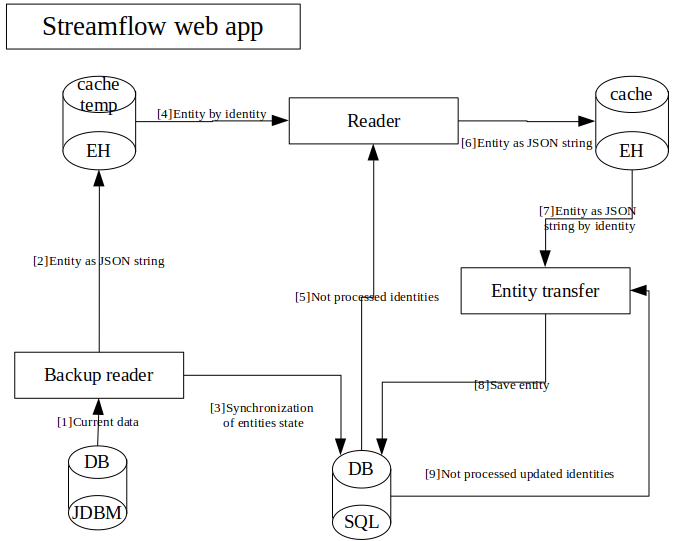

SQL Export
==========

Current data model
------------------

Search in Streamflow web app based on Elastic search (ES) indexing. Flow is next:
    #. Compose entity state.
    #. Index entity state.
We don’t consider persist to database, because it isn’t necessary.
ES indexes objects are JSON representation in next form:

    .. code-block:: json

        {
            "_identity": "ENTITY_UUID_KEY",
            "_types": [ "FULL",  "NAME", "OF", "JAVA", "TYPES"]
            "propertyNameOfEntity": propertyValue,
            …,
            "propertyNameOfEntity": propertyValue,
            "associationName": "ASSOCIATED-IDENTITY",
            …,
            "associationName": "ASSOCIATED-IDENTITY",
            "manyassociationName": [ "ASSOCIATED", "IDENTITIES" ],
            …,
            "manyassociationName": [ "ASSOCIATED", "IDENTITIES" ]
        }

Search works according to JSON entity state properties.
Index represantation isn’t equals JDBM persisted data. JDBM entity states has following JSON properties:

    .. code-block:: json
        {
            "identity": "ENTITY_UUID_KEY",
            "application_version": "APP_VERSION",
            "type": "FULL_NAME_OF_JAVA_TYPE",
            "version": "ENTITY_UUID_VERSION",
            "modified": 1408518997302,
            "properties": {
                "propertyNameOfEntity":  propertyValue,
                ….,
                "propertyNameOfEntity":   propertyValue
            },
            "associations": {
                "associationName": "ASSOCIATED-IDENTITY",
                …,
                "associationName": "ASSOCIATED-IDENTITY"
            },
            "manyassociations": {
                "manyassociationName": [ "ASSOCIATED", "IDENTITIES" ],
                …,
                "manyassociationName": [ "ASSOCIATED", "IDENTITIES" ]
            }
        }

For operation on entity states we need order all entities by their modified timestamp. It helps to solve problems with relations. JDBM provides api only for sorting stored objects by their id, that’s why we need to use another approach. ES helps to solve JDBM limitations. Sorted search by modified timestamp will available if we added “_modified” property to  index. After reindex we’ll be able to make ordered search by “_modified” timestamp.

Streamflow DB transfer model
----------------------------

On application startup:
^^^^^^^^^^^^^^^^^^^^^^^

    0. Reader gets information from last_processed_entities.info file where placed info about last SQL transfer.
    1. According to previous step reader gets JSON entities states from index.
    2. Reader writes entity sates (JSON string) to cache. In cache reader stores object as value with id number. Objects are sorted by modified property, so we need to generate ids started from 1 with increment. Every time of app restart, numbering will be started from 1.

       After all entities will be processed, application will start.

       Application started:
    3. Trigger of entity state change is listening changes and writing their to cache.
    4. Listener  of entity state change triggers save save to db process.
    5. Starting of entity transfer.
    6. Get object from cache.
    7. Map JSON to Hibernate entities. Persist to SQL server. Get information about persisted objects.
    8. Write information to last_processed_entities.info file.

Enable and configure at VisualVM
--------------------------------

#. Setup datasource

    Example for Microsoft SQL server:

    .. image:: images/visualvm_datasource.png
        :align: center
        :width: 100%

    .. note::
        Don't forget to create scheme at DB

#. Enable entity export

    Settings located under StreamflowServer -> Domain

    .. image:: images/visaulvm_entity_export.png
        :align: center
        :width: 100%

Pitfalls
--------
* In order to completely reset SQL export required following steps:

    #. Remove folder **{StreamflowServer}/data/entityexport** at SF data folder
    #. Recreate DB scheme which was used before

* Unexpected interruption

    * If server was stopped/restarted or disabled by some pig at server room feel free to start again and export will go further.
    * If still not running as expected perform reset procedure described above.

.. important::
    Don't remove folder **{StreamflowServer}/data/entityexport** without need to perform reset. It's needed for correct work of entity export.
