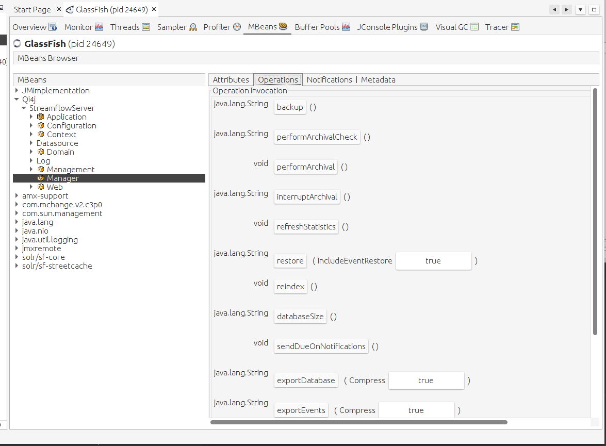

Restore data
============

#. Firstly you needed files created at :doc:`backup_data`

#. Then copy files obtained from backup to same folder **{StreamflowServer}/data/backup**.

#. Open VisualVM and click MBeans tab. There open path **Qi4j/StreamflowServer/Manager**.

#. Then click at *Operations* tab. There should **restore** button. Click on it.

.. note::
   Or you can jsut fully replace **{StreamflowServer} folder